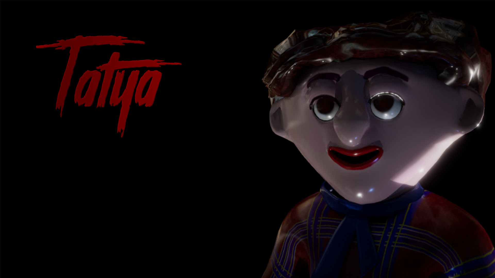

# Tatya-v1.2.0

Tatya gameplay walkthrough: https://youtu.be/txA7d0jqw8g?si=R84R4qaz3W_HVNYc

"Tatya" is a puzzle-based survival horror game inspired by the character Tatya Vinchu from the film Zapatlela. Players must explore a dark, atmospheric environment, solve puzzles, and survive against a relentless threat.  
 - Check releases for the latest playable build 

a Sem 4 (2nd year) - University Project, developed by a Passionate team of 7 young developers.

My Role (Mrunal Mendole) - Lead Game Programmer:
1) Led a group of 3 Programmers in combining gameplay mechanics with a Linear narrative-driven experience.
2) Developed core game flow systems, including dialogue system, progression tracking, and game over conditions.
3) Created responsive UI/UX elements, Handled sound design and integration including spatial audio and adaptive BGMs.
4) Co-developed a modular puzzle system, enabling multiple interactive challenges and player-triggered events.
5) Collaborated in a team of 7 members (incl. artists & designers) to align gameplay systems with the overall story.

 
Credits:  
Music:  
ErikMMusic - Look Behind You: https://youtu.be/BntrNnlKydE?si=CkOs24FBYXOu0Z65  

Font:  
Cat Butcher - Stranger Back in the Night: https://www.dafont.com/stranger-back-in-the-night.font

